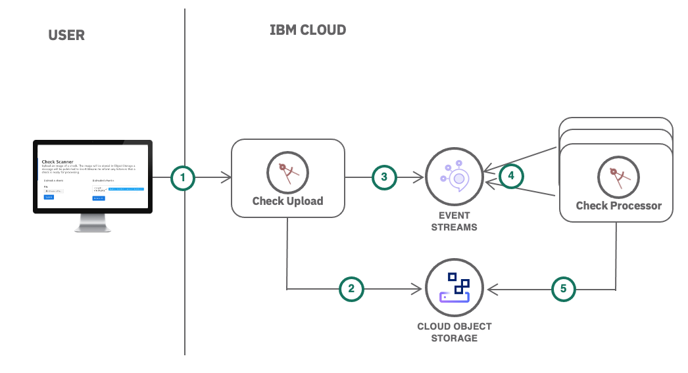

# Asynchronous data processing using object storage and pub/sub messaging

In this tutorial, you will learn how to use an Apache Kafka based messaging service to orchestrate long running workloads to applications running in a Kubernetes cluster. To simulate this use case, you will first create a UI application which will be used to upload files to object storage and generate messages indicating work to be done. Next, you will create a separate worker application which will asynchronously process the user uploaded files when it receives messages.

[View Tutorial](https://console.bluemix.net/docs/tutorials/pub-sub-object-storage.html)

