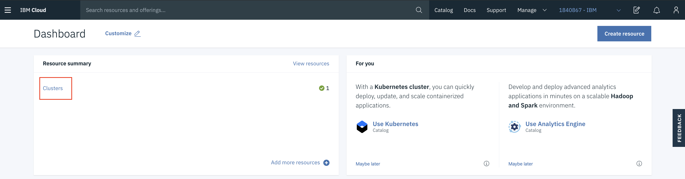
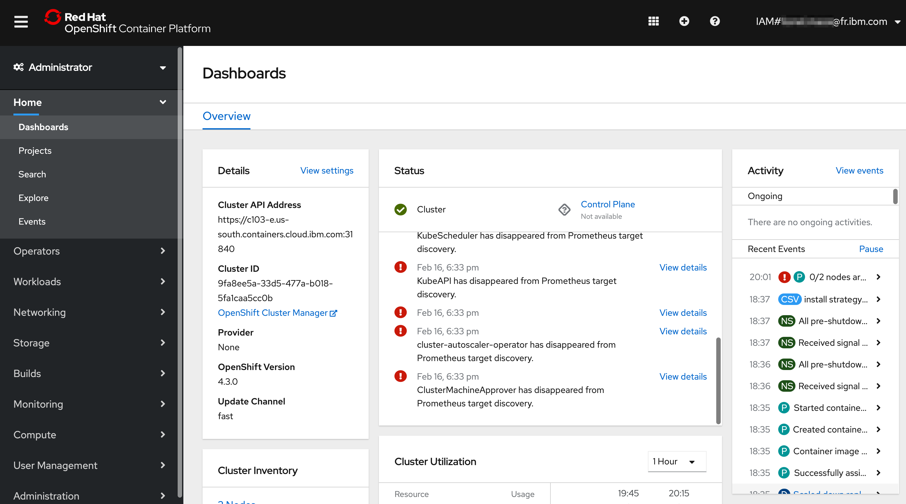

# Access the OpenShift web console

1. In the [IBM Cloud Dashboard](https://cloud.ibm.com), click on **Clusters** in the **Resource Summary** tile.

    

2. Under **Clusters**, click on the cluster that has been assigned to you.

    

3. You can also see your cluster in the list of OpenShift clusters [IBM Cloud Clusters Dashboard](https://cloud.ibm.com/kubernetes/clusters?platformType=openshift)

    

4. Have a look at the cluster overview!

    

5. Click on **OpenShift web console** on the top right to launch the web console.

    
