# Deploying an application

In this exercise, you'll deploy a simple Node.js Express application - "Check Upload". Check Upload is a simple UI for uploading images of checks. We'll use this example to demonstrate key OpenShift features throughout this workshop. You can find the sample application GitHub repository here: [https://github.com/rvennam/check-scanner](https://github.com/rvennam/check-scanner)

## Create Check Scanner project

1. Launch the `OpenShift web console`.

    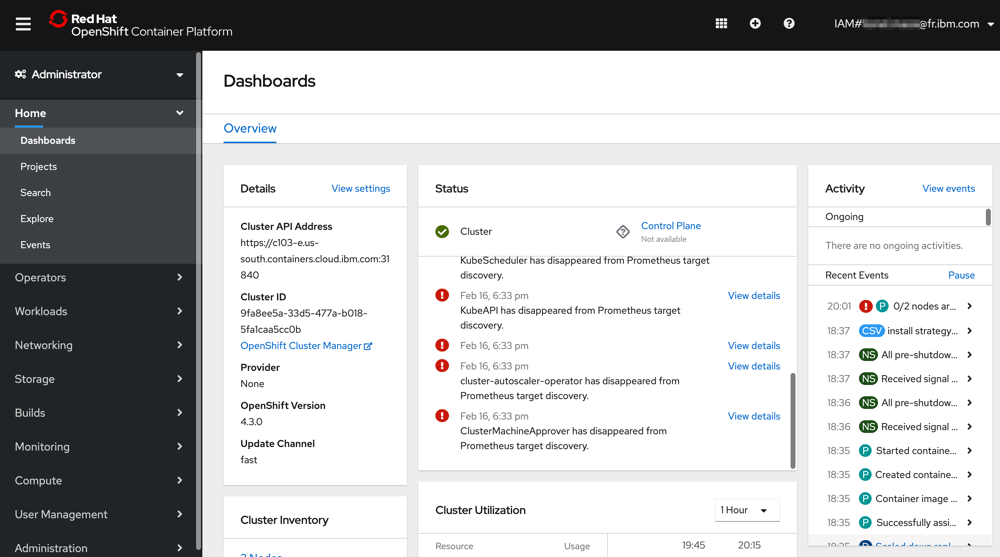

1. Select the **Projects** view to display all the projects.

    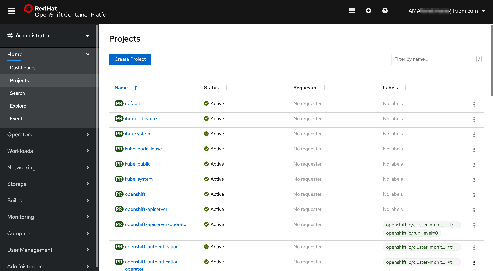

1. Create a new project by selecting **Create Project**. Call the project "check-scanner".

    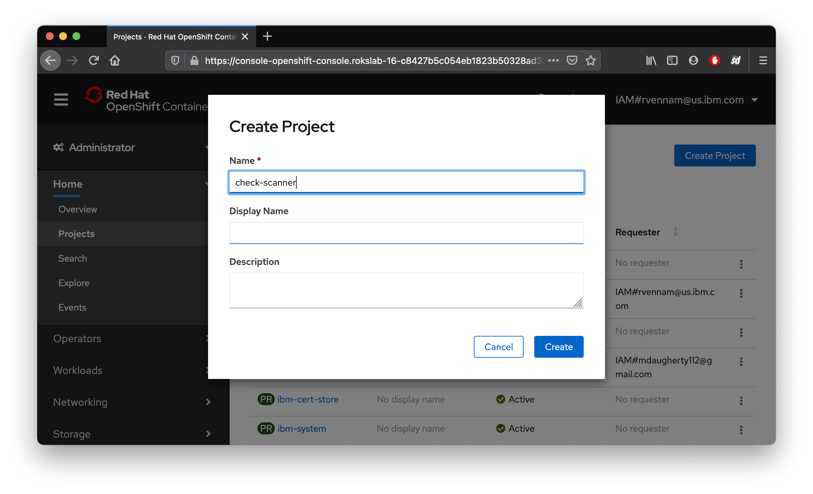

1. You should see a view that looks like this.

    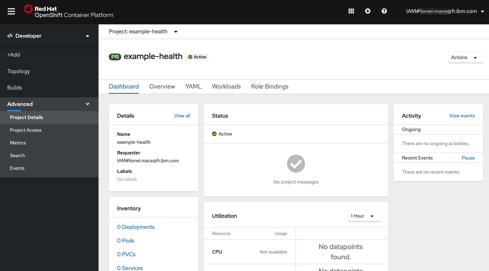

## Deploy Check Upload application

1. Switch from the Administrator to the **Developer** view. Make sure your project is selected.

    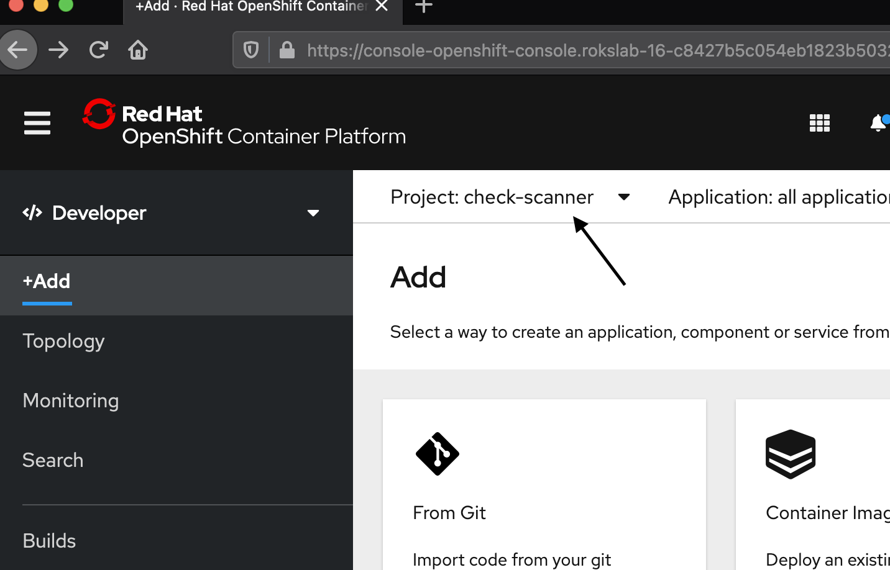

1. Let's deploy the application by selecting **From Git**.

1. Enter the repository `https://github.com/rvennam/check-scanner` in the Git Repo URL field.

    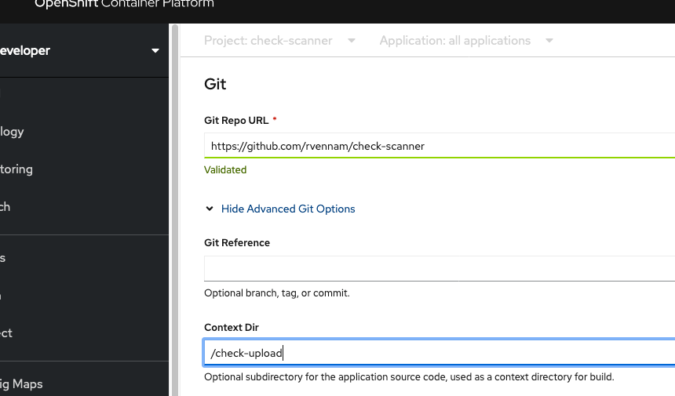

1. Expand **Show Advanced Git Options** and under **Context Dir** enter `/check-ui`

1. Under **Builder**, select **Node.js**

1 Under **General**
    **Application Name**: Remove all characters and leave the field empty.
    **Name**: `check-upload`
   
   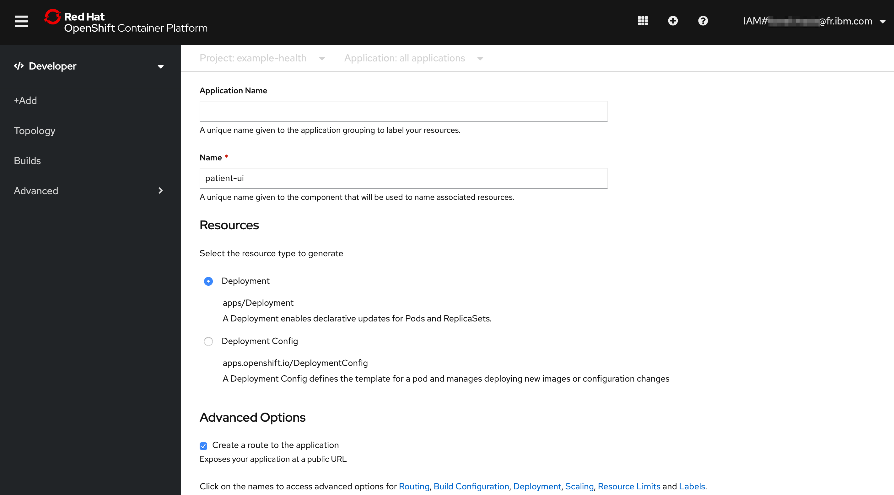
   
1. Click **Create** at the bottom of the window to build and deploy the application.

    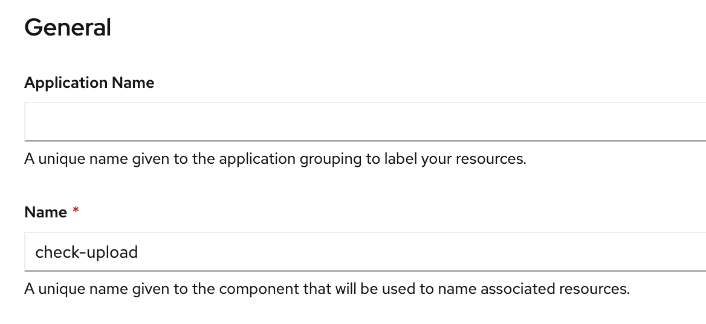

    Your application is being deployed.

## View the Example Health

1. You should see the app you just deployed.

    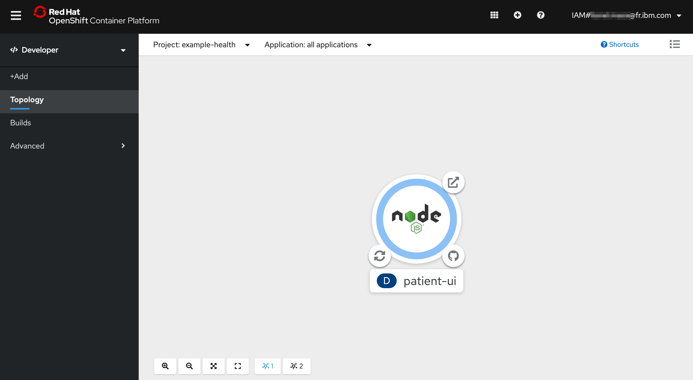

2. Select the app and check on **Resources**. You should see your Pods, Builds, Services and Routes.

    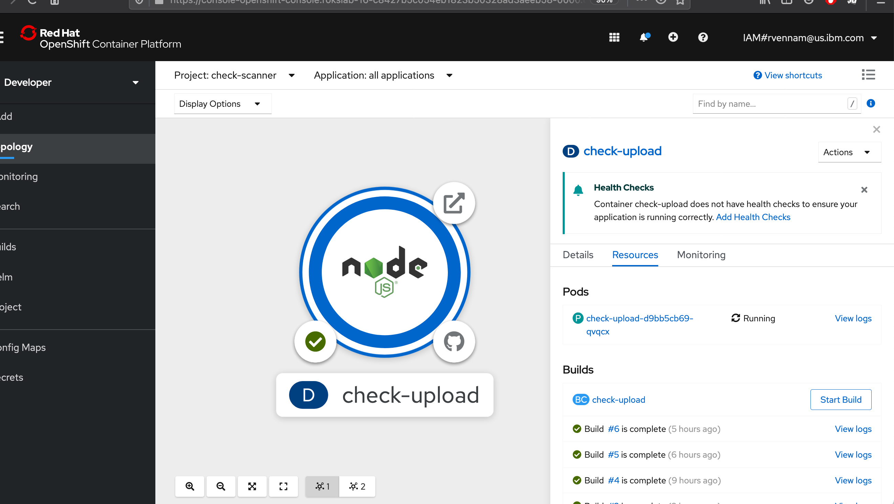

    * **Pods**: Your Node.js application containers
    * **Builds**: The auto-generated build that created a Docker image from your Node.js source code, deployed it to the OpenShift container registry, and kicked off your deployment config.
    * **Services**: Tells OpenShift how to access your Pods by grouping them together as a service and defining the port to listen to
    * **Routes**: Exposes your services to the outside world using the LoadBalancer provided by the IBM Cloud network

3. The build can take a few minutes. Click on **View Logs** next to your Build. This shows you the process that OpenShift took to install the dependencies for your Node.js application and build/push a Docker image.

    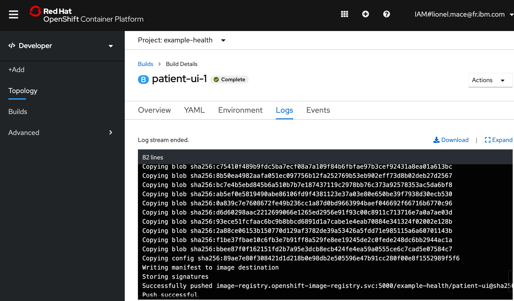

    You should see that looks like this:
    ```
    Successfully pushed image-registry.openshift-image-registry.svc:5000/check-scanner/check-upload@sha256:e98f9373ec8864a92a155ced589712722cc26670d265ee209e60a78343325688
    Push successful
    ```

4. Click back to the **Topology** and select your app again. Click on the url under **Routes** to open your application with the URL.

    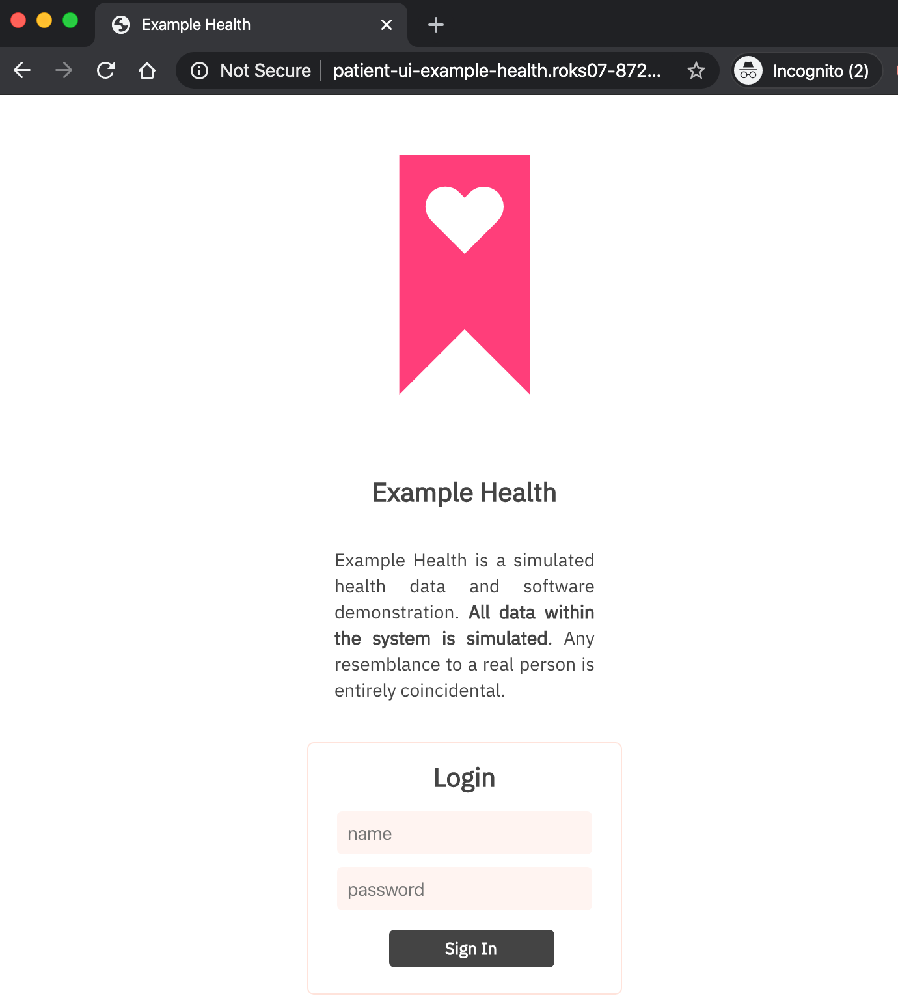

Congrats! You've deployed a `Node.js` app to OpenShift Container Platform.

You've completed the first exercise! Let's recap -- in this exercise, you:

* Deployed the "Example Health" Node.js application directly from GitHub into your cluster 
  * Used the "Source to Image" strategy provided by OpenShift
* Deployed an end-to-end development pipeline 
  * New commits that happen in GitHub can be pushed to your cluster with a simple \(re\)build
* Looked at your app in the OpenShift console.

## What's Next?

Let's dive into some Day 1 OpenShift Operations tasks, starting with Monitoring and Logging