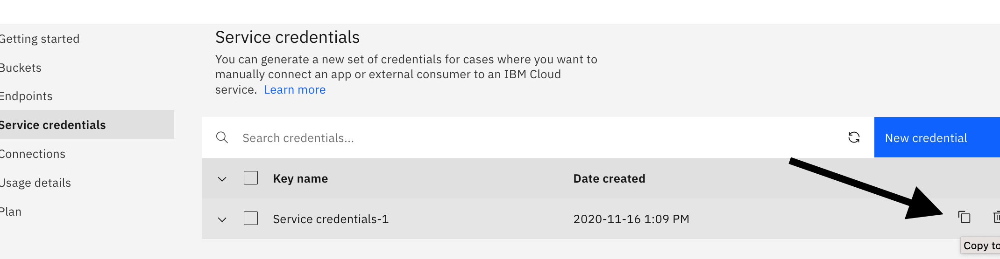
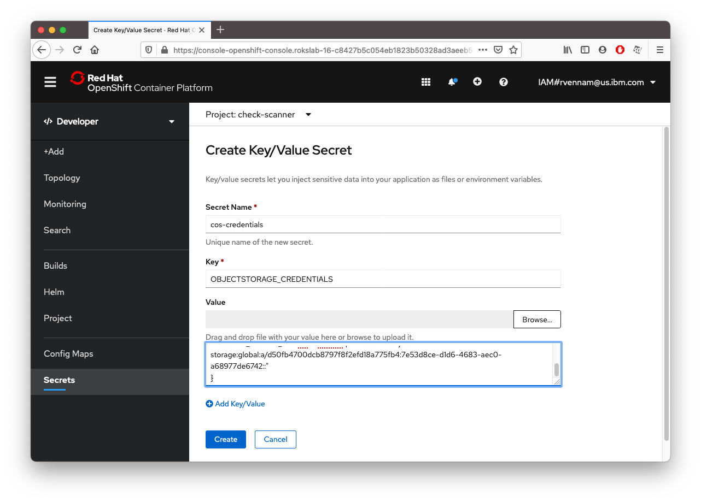
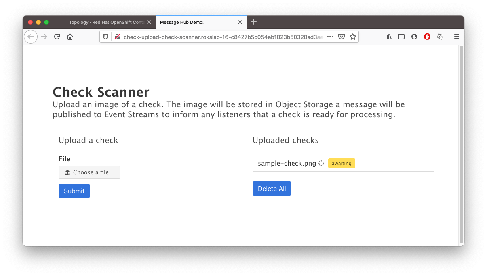

## Create an IBM Cloud Object Storage service

IBM Cloud Object Storage is encrypted and dispersed across multiple geographic locations, and accessed over HTTP using a REST API. It provides flexible, cost-effective, and scalable cloud storage for unstructured data. You will use this to store the files uploaded by the Check Upload application.

1. In your `IBM Cloud` tab, click on [Catalog](https://cloud.ibm.com/catalog), create a **Cloud Object Storage service**,
   1. **Plan**: **Standard**
   2. **Service name**: `<your-initials>-cos`. For example: `rv-cos`
   3. Select a resource group and click **Create**
2. Under **Buckets**, click **Create bucket**.
3. Create a **Custom bucket** -> **Customize your bucket** 
   1. **Unique bucket name** : `check-images`
   2. **Resiliency** : **Cross Region** 
   3. **Location** : **us-geo**  
   4. Scroll down and and click **Create bucket**
4. Provide the service credentials to your application
   1. **Service Credentials** -> **New credential** -> **Add**
   2. Expand **Service credentials-1** and then click on the Copy icon.
   

You've now created a Object Storage instance and have the credentials copied to your clipboard. Lets give these credentials to your application.

1. In your OpenShift dashboard tab, click on **Secrets** 
2. **Create** -> **Key/Value Secret**
   1. **Secret Name** : `cos-credentials`
   2. **Key** : `OBJECTSTORAGE_CREDENTIALS`
   3. **Value** : Press Cmd+V(Mac)/Ctrl-V(Windows) to paste from your clipboard. 
   
   4. **Create**
   5. **Add Secret to Workload** -> **Select a workload** -> **check-upload**
   6. **Save**

Your application pod will restart with these new object storage credentials. Visit your application route again. You should now be able to upload images and have them be stored in Object Storage. 

Download this sample check image and upload it to the app. Right click and save this image to your computer:

Upload it to your Check Upload app.

Notice that the checks are stuck in "awaiting" status. We haven't deployed our Check Processor application yet. Let's do that next.