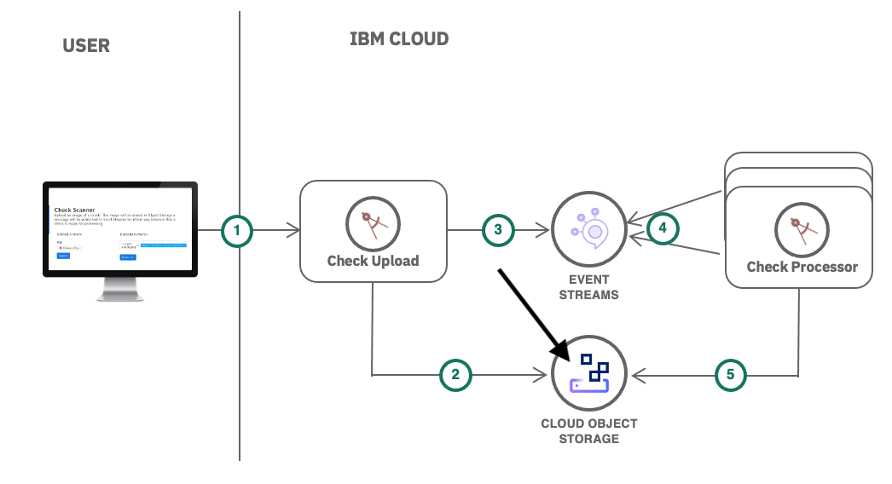

## Create an IBM Cloud Object Storage service

The Object Storage service is encrypted and dispersed across multiple geographic locations, and accessed over HTTP using a REST API. It provides flexible, cost-effective, and scalable cloud storage for unstructured data. You will use this to store the files uploaded by the Check Upload application.

1. In your **IBM Cloud** tab, click on [Catalog](https://cloud.ibm.com/catalog), create a **Object Storage** service,
   1. **Plan**: **Standard**
   2. **Service name**: `<your-initials>-cos`. For example: `rrv-cos`
   3. Select a resource group and click **Create**
2. Under **Buckets**, click **Create bucket**.
3. Create a **Custom bucket** -> **Customize your bucket** 
   1. **Unique bucket name** : `<your-initials>-check-images` . For example: `rv-check-images`
   2. **Resiliency** : **Cross Region** 
   3. **Location** : **us-geo**  
   4. Scroll down and and click **Create bucket**
   
4. Create the service credentials
   1. **Service Credentials** -> **New credential** -> **Add**
   2. Expand **Service credentials-1** and then click on the Copy icon.
   

You've now created a Object Storage instance and have the credentials copied to your clipboard. Lets give these credentials to your application.

### Bind the credentials to your app

The Secret object type provides a mechanism to hold sensitive information such as passwords and keys. These secrets can then be added to your application.

1. In your OpenShift web console tab, click on **Secrets** 
2. **Create** -> **Key/Value Secret**
   1. **Secret Name** : `cos-credentials`
   2. **Key** : `OBJECTSTORAGE_CREDENTIALS`
   3. **Value** : Press Cmd+V(Mac)/Ctrl-V(Windows) to paste from your clipboard. 
   
   4. **Create**
   5. **Add Secret to Workload** -> **Select a workload** -> **check-scanner-upload**
   6. **Save**
   
<!-- Create another secret for the bucket name:

1. Click on **Secrets** 
2. **Create** -> **Key/Value Secret**
   1. **Secret Name** : `cos-bucketname`
   2. **Key** : `COSBUCKETNAME`
   3. **Value** : Enter the value you set for the bucket name above
   
   1. **Create**
   2. **Add Secret to Workload** -> **Select a workload** -> **check-scanner-upload**
   3. **Save** -->
   
Your application will restart with these new object storage credentials. 

### Upload a sample check image to your app

1. Visit your application route again. You can find it again by going to **Topology**, clicking on your app, and then clicking on the **URL** under **Routes**.

2. You should now be able to upload images and have them be stored in Object Storage. Download this sample image by right clicking and saving this image to your computer:

3. Upload the check image to your Check Upload app.

The check image is now stored in Object Storage. However, notice that the checks are stuck in "awaiting" status. We haven't deployed our Check Processor application yet. Let's do that next.