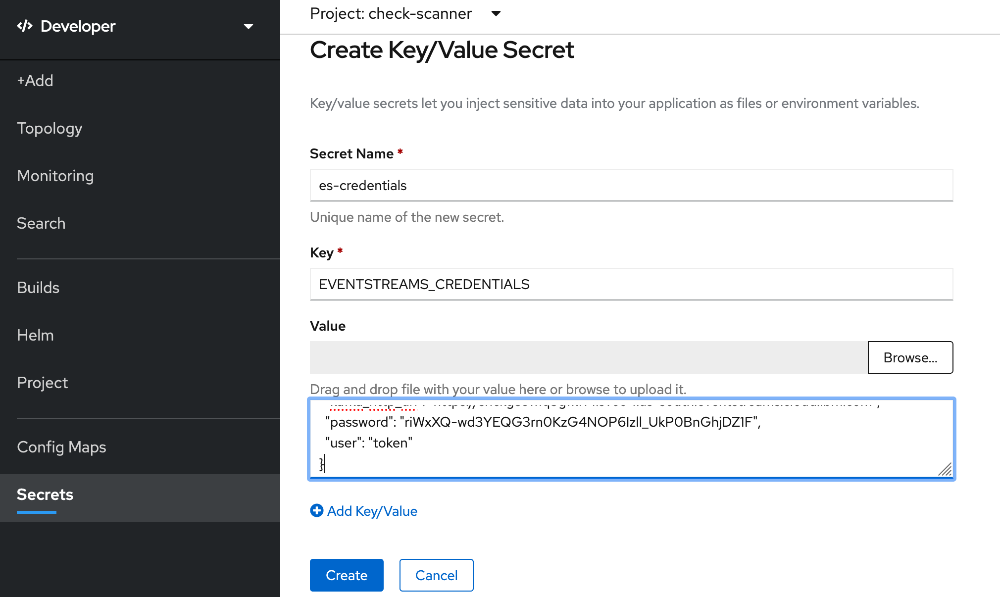
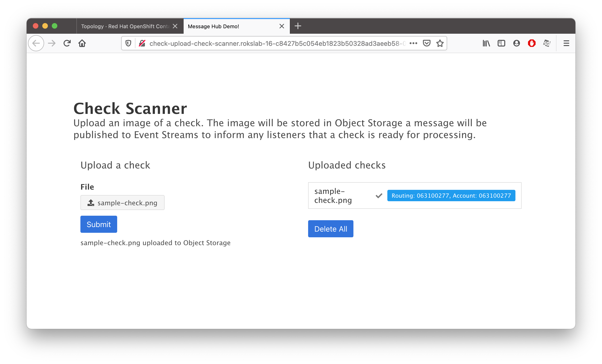

## Create an IBM Cloud Event Streams service

IBM Cloud Event Streams is a fast, scalable, fully managed messaging service, based on Apache Kafka, an open-source, high-throughput messaging system which provides a low-latency platform for handling real-time data feeds.

1. In your `IBM Cloud` tab, click on [Catalog](https://cloud.ibm.com/catalog), create a **Event Streams** service.
   1. **Plan**: **Standard**
   2. **Service name**: `<your-initials>-es`. For example: `rv-es`
   3. Select a resource group and click **Create**
2. Under **Manage**, switch to **Topics** tab.
   1. Click on **Create topic** and provide `work-topic` as the Topic name. Click **Next**
   2. Select **1** partition, click **Next** and choose **A day** of Message retention.
   3. Click **Create topic**
3. Provide the service credentials to your application
   1. **Service Credentials** -> **New credential** -> **Add**
   2. Expand **Service credentials-1** and then click on the Copy icon.
   

You've now created a Event Streams instance and have the credentials copied to your clipboard. Let's give these credentials to your application.

1. In your OpenShift dashboard tab, click on **Secrets** 
2. **Create** -> **Key/Value Secret**
   1. **Secret Name** : `es-credentials`
   2. **Key** : `EVENTSTREAMS_CREDENTIALS`
   3. **Value** : Press Cmd+V(mac)/Ctrl-V(Windows) to paste from your clipboard. 
   
   4. **Create**
   5. **Add Secret to Workload** -> **Select a workload** -> **check-processor** -> **Save**

Bind the secret to Check Upload app as well:

1. Click on **Secrets** 
2. Click on **es-credentials**
3. **Add Secret to Workload** -> **Select a workload** -> **check-upload** -> **Save**

Both of your applications will restart with the new sets of credentials. 

Visit your Check Upload application and upload the sample image again. This time, you will see that the check getting processed in a few seconds. 

Congrats! You've deployed both applications and configured them with the Event Stream and Object Storage services!