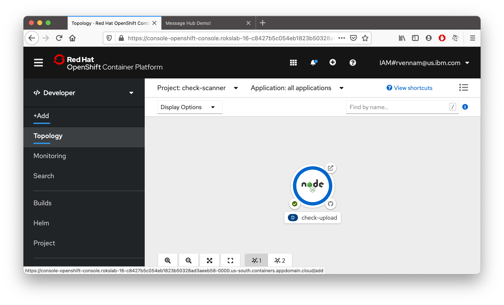
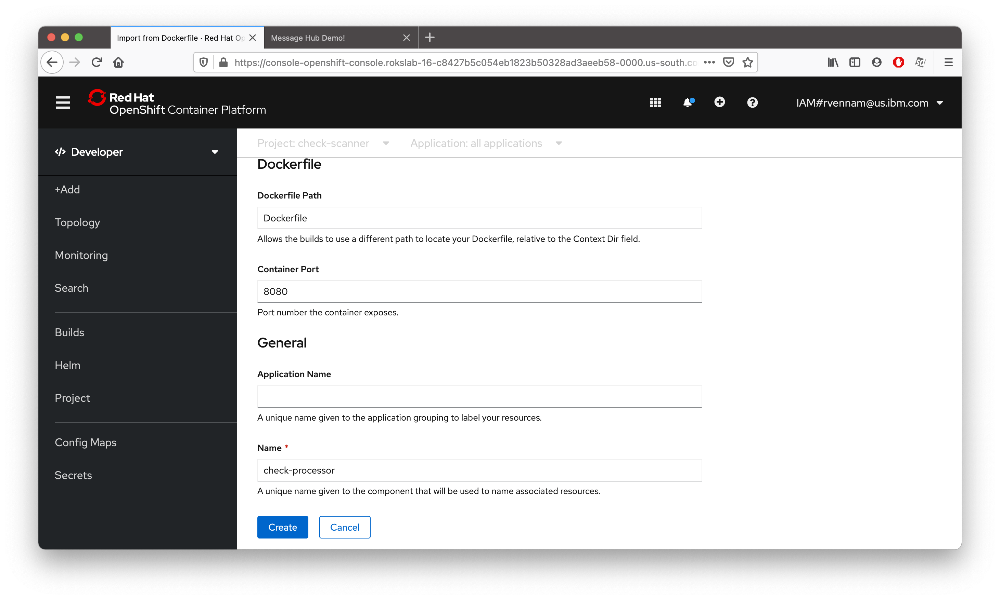

## Deploy Check Processor application

1. Confirm you're in the **Developer** view. Make sure your `check-scanner` project is selected and click **+Add**

    

2. This time, let's deploy the application by selecting **From Dockerfile**.

3. Enter the repository `https://github.com/rvennam/check-scanner` in the Git Repo URL field.

    

4. Expand **Show Advanced Git Options** and under **Context Dir** enter `/check-processor`

1 Under **General**
    **Application Name**: Remove all characters and leave the field empty.
    **Name**: `check-processor`
   
   

1 Uncheck **Create a route to the application**. This application does not have a UI.
   
1. Click **Create** at the bottom of the window to build and deploy the application.

    

    Your application is being deployed.

## Bind Object Storage credentials to Check Processor

1. In your OpenShift dashboard tab, click on **Secrets** 
2. Click on **cos-credentials**
3. **Add Secret to Workload** -> **Select a workload** -> **check-processor** -> **Save**

Check Processor app is now able retrieve images from Object Storage. However, we still need a message bus to tell the app when a new image is ready. Let's make that next.