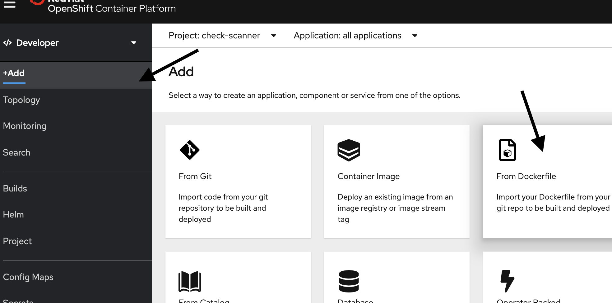

## Deploy the Check Processor application

1. Confirm you're in the **Developer** view. Make sure your `check-scanner` project is selected and click **+Add**

    

2. This time, let's deploy the application by selecting **From Dockerfile**.

3. Enter the repository `https://github.com/rvennam/check-scanner-processor` in the Git Repo URL field.

4. Uncheck **Create a route to the application**. This application does not have a UI.
   
5. Click **Create** at the bottom of the window to build and deploy the application.

Your application is being deployed.

## Bind Object Storage credentials to Check Processor
Let's share the credentials of the Object Storage service to this application too. We already created a secret with the credentials. We now just need to bind that secret to this application as well.

1. In your OpenShift dashboard tab, click on **Secrets** 
2. Click on **cos-credentials**
3. **Add Secret to Workload** -> **Select a workload** -> **check-scanner-processor** -> **Save**

<!-- Bind the bucket name secret as well:

1. Click on **Secrets** 
2. Click on **cos-bucketname**
3. **Add Secret to Workload** -> **Select a workload** -> **check-scanner-processor** -> **Save** -->

Check Processor app is now able retrieve images from Object Storage. However, we still need a message bus to tell the app when a new image is ready. Let's make that next.