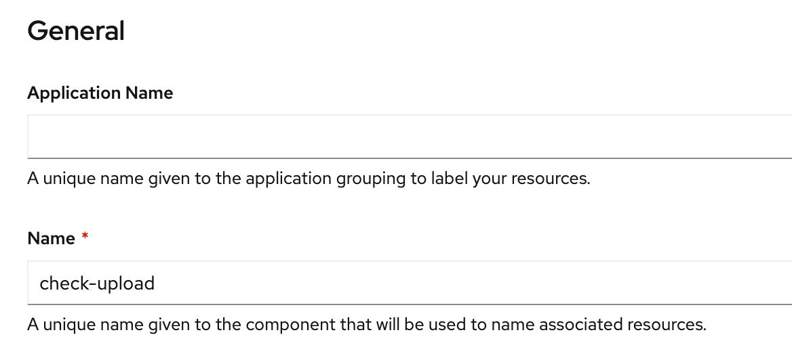

# Deploying the Check Upload application

In this exercise, you'll deploy the first application - Check Upload. Check Upload is a simple UI for uploading images of checks. You can find the sample application GitHub repository here: [https://github.com/rvennam/check-scanner](https://github.com/rvennam/check-scanner)

## Create Check Scanner project

In OpenShift Container Platform, projects are used to group and isolate related objects. As an administrator, you can give developers access to certain projects, allow them to create their own, and give them administrative rights within individual projects.

1. Select the **Projects** view to display all the projects.

    

2. Create a new project by selecting **Create Project**. Name the project `check-scanner`.

    


## Deploy Check Upload application

1. Switch from the Administrator to the **Developer** view. Make sure your project is selected.

    

1. Let's deploy the application by selecting **From Git**.

1. Enter the repository `https://github.com/rvennam/check-scanner` in the Git Repo URL field.

1. Expand **Show Advanced Git Options** and under **Context Dir** enter `/check-ui`

    

1. Under **Builder**, select **Node.js**
   
2. **Application Name**: Remove all characters and leave the field empty.
   
3. **Name**: `check-upload`

    
   
4. Click **Create** at the bottom of the window to build and deploy the application.

Your app is now being built and deployed. OpenShift will retrieve the source code from GitHub, build a container image, push the image to the image registry, and then run a container in a pod.

## View the Check Upload app

1. Select the app and check on **Resources**. You should see your Pods, Builds, Services and Routes.

    

    * **Pods**: Your Node.js application containers
    * **Builds**: The auto-generated build that created a Docker image from your Node.js source code, deployed it to the OpenShift container registry, and kicked off your deployment config.
    * **Services**: Tells OpenShift how to access your Pods by grouping them together as a service and defining the port to listen to
    * **Routes**: Exposes your services to the outside world using the LoadBalancer provided by the IBM Cloud network

2. The build can take a few minutes. Click on **View Logs** next to your Build. This shows you the process that OpenShift took to install the dependencies for your Node.js application and build/push a Docker image.

    You should see that looks like this:
    ```
    Successfully pushed image-registry.openshift-image-registry.svc:5000/check-scanner/check-upload@sha256:e98f9373ec8864a92a155ced589712722cc26670d265ee209e60a78343325688
    Push successful
    ```

3. Once the build is complete, you should see the **Pod** will switch to **Running**. Click on **View logs**

    

    Notice the lines `Event Streams credentials not found!` and `Object Storage credentials not found!`

4. Click back to the **Topology** and select your app again. Click on the url under **Routes** to open your application with the URL.

    

Congrats! You've deployed a `Node.js` app to OpenShift Container Platform.

You've completed the first exercise! Let's recap -- in this exercise, you:

* Deployed the "Check Upload" Node.js application directly from GitHub into your cluster 
  * Used the "Source to Image" strategy provided by OpenShift
* Deployed an end-to-end development pipeline 
  * New commits that happen in GitHub can be pushed to your cluster with a simple \(re\)build
* Looked at your app in the OpenShift console.

## What's Next?

You created the application, but now you need to create the Object Storage and Event Streams services and configure your application to talk to them.
