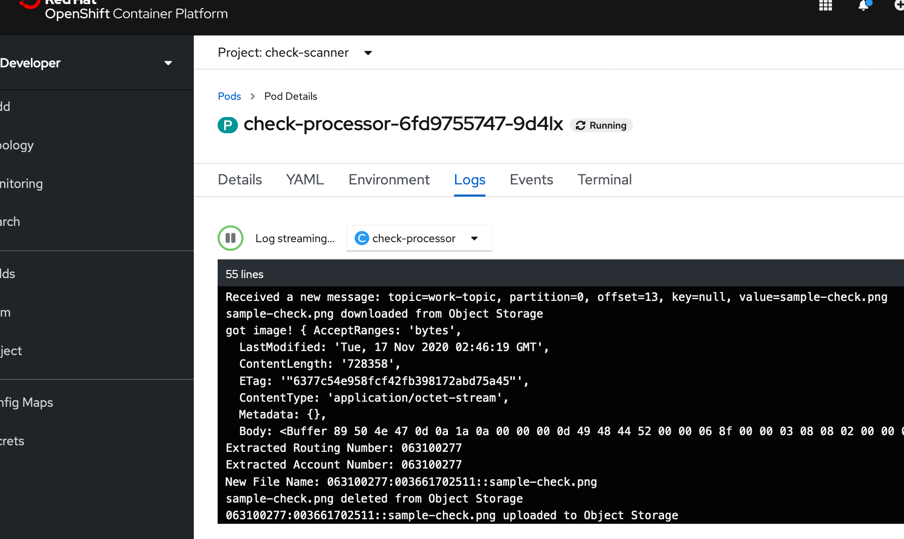
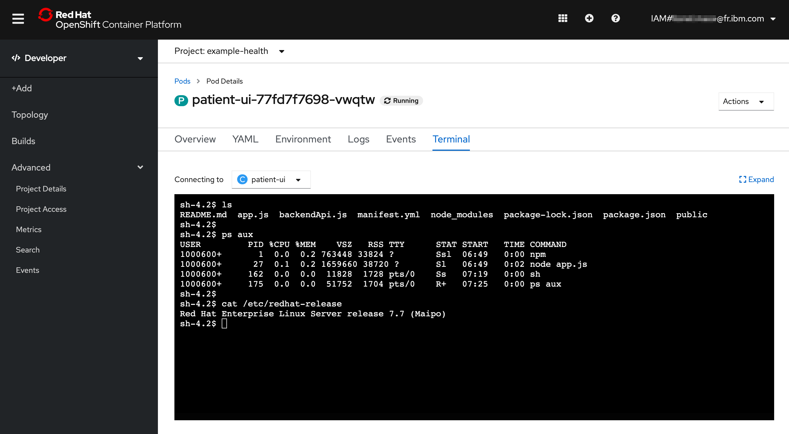
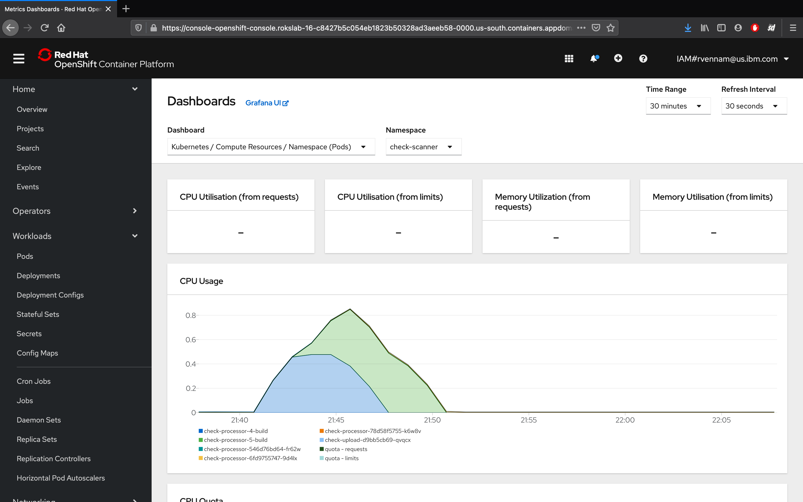
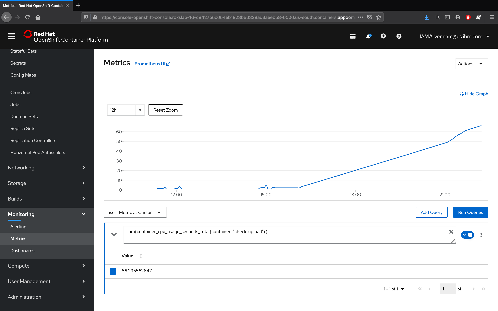

# Logging and monitoring

In this exercise, we'll explore the out-of-the-box logging and monitoring capabilities that are offered in OpenShift.

## OpenShift Logging

Since we only created one pod, seeing our logs will be straight forward.

1. Ensure that you're in the **Developer** view. Then, navigate to **Topology**.

2. Navigate to your Pod by selecting your **check-processor** app, then clicking the name of the Pod under **Pods**.
   
3. Click on **View Logs** next to your Pods to see streaming logs from your running application.

    

## OpenShift Terminal

One of the great things about Kubernetes is the ability to quickly debug your application pods with SSH terminals. This is great for development, but generally is not recommended in production environments. OpenShift makes it even easier by allowing you to launch a terminal directly in the dashboard.

1. Navigate to your Pod by selecting your app, then clicking the name of the Pod under **Pods**.

2. Switch to the **Terminal** tab

   

3. Run the following Shell commands:

| Command | Description | 
| :--- | :--- |
| ls | List the project files. |
| ps aux | List the running processes. |
| cat /etc/redhat-release | Show the underlying OS. |

## OpenShift Monitoring

### Grafana

Red Hat OpenShift on IBM Cloud comes with [Grafana](https://grafana.com/) preinstalled.

1. Get started by switching from the **Developer** perspective to the **Administrator** perspective:
2. Navigate to **Monitoring > Dashboards** in the left-hand bar. 
3. Select **Kubernetes / Compute Resources / Namespace (Pods)** from the dropdown (initially set to etcd) and Namespace to **check-scanner**
4. Notice the CPU and Memory usage for your application. In production environments, this is helpful for identifying the average amount of CPU or Memory your application uses, especially as it can fluctuate through the day.

)

### Prometheus

Navigating back to the OpenShift console, you can also launch:

* [**Prometheus**](https://prometheus.io/) - a monitoring system with an efficient time series database
* [**Alertmanager**](https://prometheus.io/docs/alerting/alertmanager/) - an extension of Prometheus focused on managing alerts

OpenShift provides a web interface to Prometheus, which enables you to run Prometheus Query Language \(PromQL\) queries and examine the metrics visualized on a plot. This functionality provides an extensive overview of the cluster state and enables you to troubleshoot problems. Take a look around, and try the **Insert Example Query**.

1. The Metrics page is accessible in the **Administrator** perspective by clicking **Monitoring → Metrics**.
2. A query expression can be entered.  Paste in the following to get a look at our frontend:
   ```
   sum(container_cpu_usage_seconds_total{container="check-upload"})
   ```
   {:pre}
3. Click on the **Graph** tab.  Note that the times are GMT:




